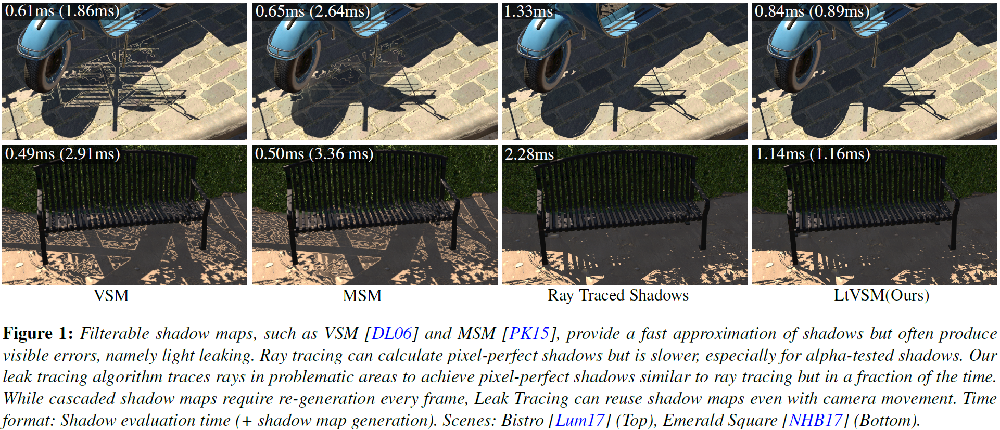
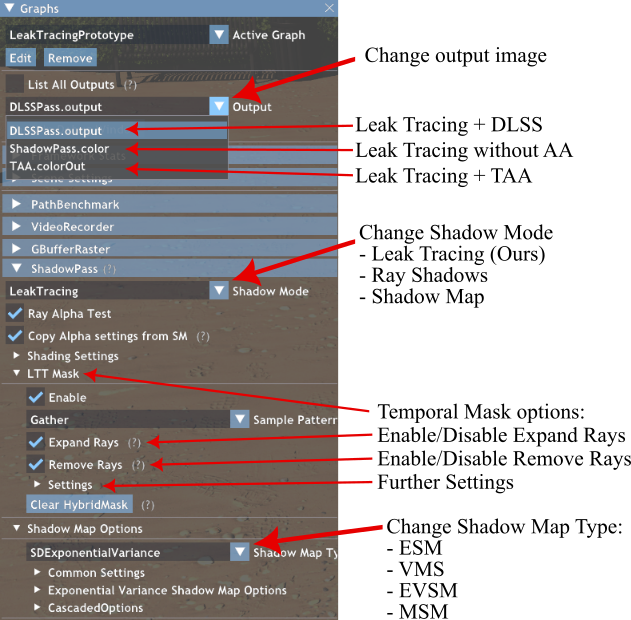
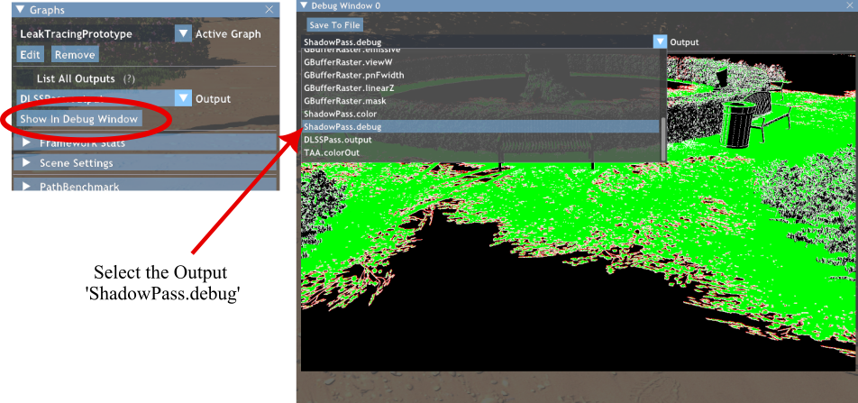

# Real-Time Pixel-Perfect Hard Shadows with Leak Tracing

## Introduction
This repository contains the source code and an interactive demo for the soon-to-be-published EGSR paper.

This prototype implements Leak Tracing, a hybrid algorithm that combines filterable shadow maps with ray tracing to produce pixel-perfect shadows. Selective ray tracing is employed in regions where filterable shadow maps exhibit light leaks or aliasing. No scene-dependent parameters are required, and the algorithm performs exceptionally well on alpha-tested shadows.

This project was implemented using NVIDIA's Falcor rendering framework. See [README_Falcor.md](README_Falcor.md) for the readme provided with Falcor.

You can download the executable demo from the [Releases Page](https://github.com/TU-Clausthal-Rendering/LeakTracing/releases/tag/0.9), or build the project by following the instructions in [Building Falcor](#building-falcor) or the build instructions in the original [readme](README_Falcor.md).

Teaser:

## Contents:

* [Demo usage](#demo-usage)
* [Additional Videos](#additional-videos)
* [Falcor Prerequisites](#falcor-prerequisites)
* [Building Falcor](#building-falcor)

## Demo usage
After downloading the demo from the releases page, you can execute it with the LeakTracingDemo[Scenename].bat file. The Bistro and Emerald Square scenes are not included and need to be dowloaded seperatly. After downloading simply put the whole content of the .zip in the respective subfolder of the 'Models' folder (e.g. so that `Models/Bistro/BistroExterior.fbx` exist).
- Bistro: 		https://developer.nvidia.com/orca/amazon-lumberyard-bistro
- Emerald Square: 	https://developer.nvidia.com/orca/nvidia-emerald-square

After downloading the demo from the releases page, you can execute it using the `LeakTracingDemo[SceneName].bat` file. The Bistro and Emerald Square scenes are not included and need to be downloaded separately. After downloading, simply place the entire content of the `.zip` file into the respective subfolder of the `Models` folder (e.g., so that `Models/Bistro/BistroExterior.fbx` exists).

Controls:
- `WASD` - Camera movement
- `Left Click` + `Mouse movement` - Change camera direction
- `Shift` - Speed up camera movement
- `Q, E` - Camera Down / UP
- `P` - Opens the profiler that shows the Rendertime for each Pass ('ShadowPass' is ours).
- `F9` - Opens the time menu. Animation and camera path speed can be changed here (Scale).
- `F6` - Toggels Graphs UI menu (Enabled by default)

UI:

How to add the temporal mask as a debug window:

## Additional Videos

### Bistro

Shading:
- Leak Tracing (LtEVSM): https://youtu.be/ysGlQ_99fAQ
- Ray Shadows: https://youtu.be/YRsDtrLxz3M

Shadow only:
- Leak Tracing (LtEVSM): https://youtu.be/vFqeVWm9IQs
- Ray Shadows: https://youtu.be/d5-mf5GyK4o

Leak Tracing Mask:  https://youtu.be/JIExRzhsg1I

### EmeraldSquare

Shading:
- Leak Tracing (LtEVSM): https://youtu.be/8qCPabjGv80
- Ray Shadows: https://youtu.be/vdDjck3hqd8

Shadow only:
- Leak Tracing (LtEVSM): https://youtu.be/y4AmguwgOoI
- Ray Shadows: https://youtu.be/SPUPvuxlfvw

Leak Tracing Mask:  https://youtu.be/5Q4tDJcg7LM

### Low Poly MedievalCity

Shading:
- Leak Tracing (LtEVSM): https://youtu.be/l2NFJPCo7Xs
- Ray Shadows: https://youtu.be/c4FQuiKmEbk

Shadow only:
- Leak Tracing (LtEVSM): https://youtu.be/5iubBUVoPWo
- Ray Shadows: https://youtu.be/rG6i6qF7_Mw

Leak Tracing Mask: https://youtu.be/9AQAXAAY8_4

### Forest (Camera 1 / Camera 2)

Shading:
- Leak Tracing (LtEVSM): https://youtu.be/rWpflDw3y0U / https://youtu.be/7ypJuqsQh1w
- Ray Shadows: https://youtu.be/dd5rUf4-nak / https://youtu.be/5l9eG2qmoAY

Shadow only:
- Leak Tracing (LtEVSM): https://youtu.be/V95WBmbbLh4 / https://youtu.be/Wj9UMnTY03M
- Ray Shadows: https://youtu.be/F4ykAtW5pag / https://youtu.be/GqOVZushV-A

Leak Tracing Mask: https://youtu.be/P7VCv-3lfZw / https://youtu.be/1Bbo2nPRSEE

## Falcor Prerequisites
- Windows 10 version 20H2 (October 2020 Update) or newer, OS build revision .789 or newer
- Visual Studio 2022
- [Windows 10 SDK (10.0.19041.0) for Windows 10, version 2004](https://developer.microsoft.com/en-us/windows/downloads/windows-10-sdk/)
- A GPU which supports DirectX Raytracing, such as the NVIDIA Titan V or GeForce RTX
- NVIDIA driver 466.11 or newer

Optional:
- Windows 10 Graphics Tools. To run DirectX 12 applications with the debug layer enabled, you must install this. There are two ways to install it:
    - Click the Windows button and type `Optional Features`, in the window that opens click `Add a feature` and select `Graphics Tools`.
    - Download an offline package from [here](https://docs.microsoft.com/en-us/windows-hardware/test/hlk/windows-hardware-lab-kit#supplemental-content-for-graphics-media-and-mean-time-between-failures-mtbf-tests). Choose a ZIP file that matches the OS version you are using (not the SDK version used for building Falcor). The ZIP includes a document which explains how to install the graphics tools.
- NVAPI, CUDA, OptiX (see below)

## Building Falcor
Falcor uses the [CMake](https://cmake.org) build system. Additional information on how to use Falcor with CMake is available in the [CMake](docs/development/cmake.md) development documetation page.

### Visual Studio
If you are working with Visual Studio 2022, you can setup a native Visual Studio solution by running `setup_vs2022.bat` after cloning this repository. The solution files are written to `build/windows-vs2022` and the binary output is located in `build/windows-vs2022/bin`.